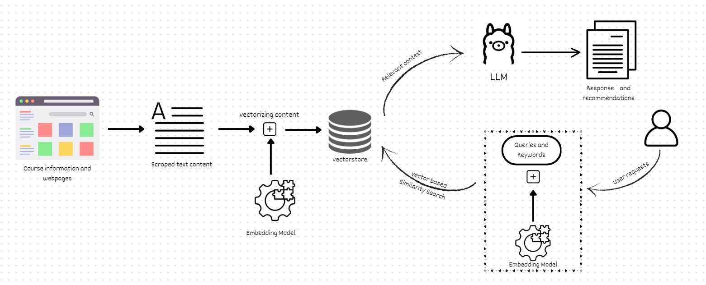
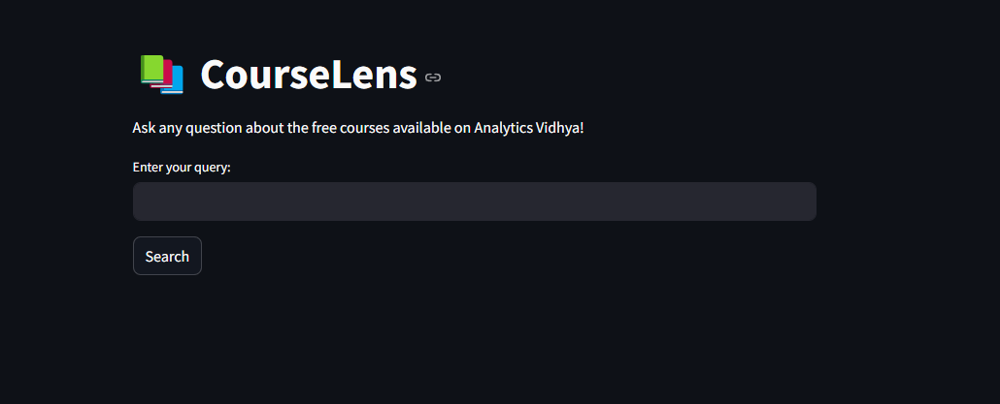
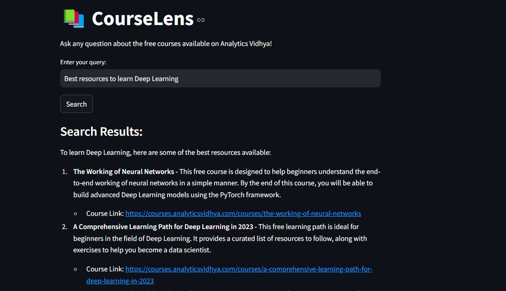
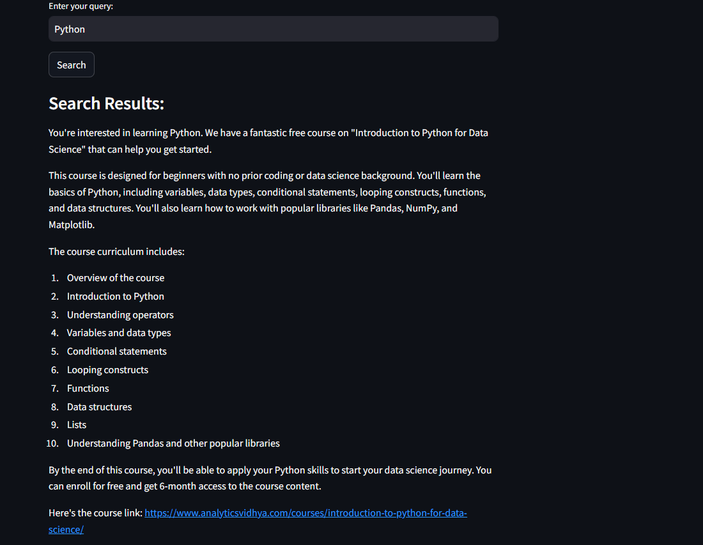
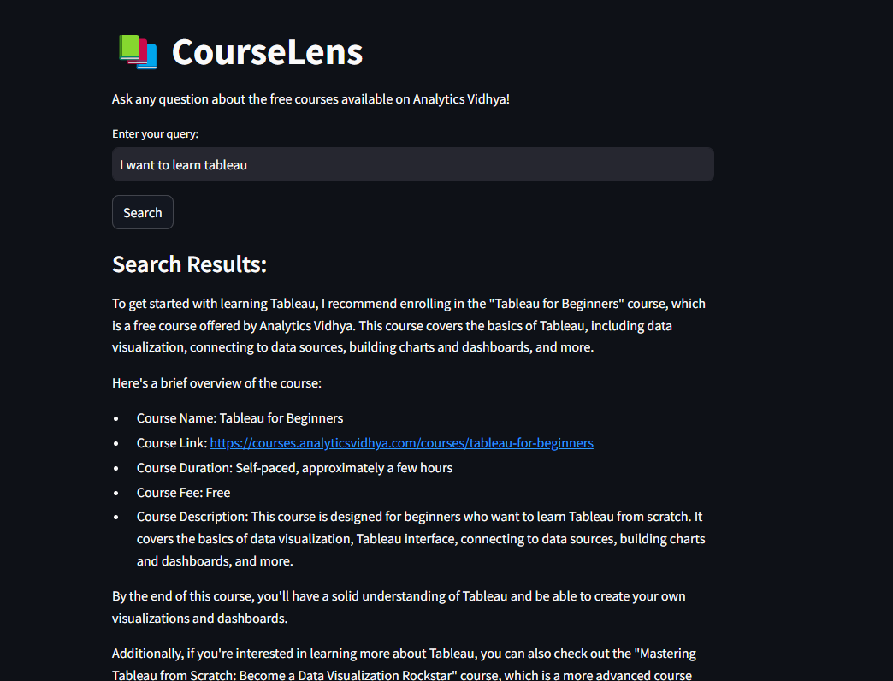

# CourseLens

This project is a **RAG (Retrieval-Augmented Generation)** based smart search system designed to assist users in finding and querying information related to the free courses available on **Analytics Vidhya**. The system provides relevant course recommendations and answers user queries based on natural language inputs.

## 🧭 Approach


This system implements a sophisticated RAG-based smart search architecture to help users discover relevant free courses from Analytics Vidhya website through natural language queries. Here's how the workflow operates:

**1. Data Collection and Preprocessing:**
- The system begins by scraping course information and webpage content from Analytics Vidhya's website
- The scraped text content is cleaned and structured for further processing

**2. Vector Processing:**
- An embedding model converts the processed text content into high-dimensional vectors
- These vectors capture the semantic meaning of the course content
- The vectorized content is stored in a vector database (vectorstore) for efficient retrieval

**3. Query Processing:**
- When a user submits a request using natural language queries or keywords
- The same embedding model converts these queries into vectors for comparison
- The system performs vector-based similarity search to find relevant matches in the vectorstore

**4. Content Retrieval and Generation:**
- The vector similarity search identifies the most relevant course content
- This relevant context is passed to a Large Language Model (LLM)
- The LLM processes the retrieved context along with the user's query
- It generates personalized responses and course recommendations

**5. Output**:
- The system provides detailed responses about relevant free courses
- Includes specific course recommendations tailored to the user's interests
- Offers context-aware suggestions based on the query's intent

The key advantage of this RAG architecture is that it combines the power of semantic search through vector embeddings with the natural language understanding capabilities of LLMs, resulting in more accurate and contextually relevant course recommendations for users interested in Analytics Vidhya's free educational content.

## 🌟 Key Features
- **AI-Powered Search**: Utilizes a combination of semantic search and generative AI to deliver precise results.
- **LLAMA 3.3 70B by Groq**: The system uses the powerful **Llama 3.3 70B model** provided by **Groq** for natural language understanding and response generation.
- **Course Content Scraper**: Automated web scraping to collect course content and metadata.
- **RAG Implementation**: Combines traditional information retrieval with a language model to improve search relevance.
- **Vector Search with Pinecone**: Efficient vector storage and similarity search using **Pinecone**.
- **Streamlit Web App**: Interactive, user-friendly interface built with **Streamlit**.

## 📊 Tech Stack
- **Python**: Core programming language
- **BeautifulSoup4** & Requests: Web scraping tools
- **Streamlit**: Framework for building web applications
- **Llama** 3.3 70B by Groq: Large language model for advanced NLP tasks
- **BGE-base-en-v1.5:** Embedding model used to handle long texts for semantic search and embedding generation
- **Pincone**: Vector database for storing and managing embeddings
- **LangChain**: Library for integrating RAG components


## 📈 Workflow
1. **Data Collection**:
   - Stored all course links in a text file for batch processing.
   - Scraped course content from Analytics Vidhya using `BeautifulSoup4` and `requests`.
2. **Data Cleaning**:
   - Removed redundant content (e.g., common descriptions across all courses).
   - Split the content into smaller chunks suitable for the model's context window.
3. **Embedding & Storage**:
   - Generated vector embeddings for the cleaned content using **Llama 3.3 70B**.
   - Stored vectors in **Pinecone** for efficient retrieval.
4. **RAG Implementation**:
   - Used a retrieval-augmented generation approach where relevant course sections are retrieved and passed to the model for generating answers.
5. **Streamlit Web App**:
   - Developed a visually appealing **Streamlit** app to allow users to search and get course recommendations.

## 📦 Project Structure
```plaintext
📂 CourseLens
├── 📂images
│    └── img-1.png
│    └── img-2.png
│    └── img-3.png
│    └── img-4.png
│    └── workflow.png
├── 📂 data
│   └── av-free-course-data.txt
│   └── extracted_content.csv
├── 📂 scraping
│   └── collect_links.py
│   └── scrape.py
|──indexing.py
├── app.py
├── query.py
├── requirements.txt
├── README.md
└── .gitignore
```

## 🎯 How to Run the Project
1. **Clone the Repository:**
   ```bash
   git clone https://github.com/devroopsaha744/CourseLens
   cd CourseLens
   ```
2. **Install Dependencies:**
   ```bash
   pip install -r requirements.txt
   ```
3. **Run the Streamlit App:**
   ```bash
   streamlit run app.py
   ```
### **Benchmarking Table for CourseLens**  

| **Metric**                | **Initial Configuration**                                             | **Final Configuration**                                             | **Improvement**                |  
|---------------------------|-----------------------------------------------------------------------|----------------------------------------------------------------------|-------------------------------|  
| **Query Latency**         | ~600 ms (Gemini 1.5 Pro, Qdrant & all-MiniLM-L6-v2)                        | ~300 ms (Groq Llama 3, Pinecone, BGE embeddings)                       | 50% reduction                 |  
| **Search Efficiency**     | ~65% precision, ~50% recall                                          | ~80% precision, ~66–67% recall                                       | ~35% overall improvement      |  
| **Throughput**            | Lower queries/sec due to higher latency and sequential processing     | ~45% more queries/sec enabled by lower latency and parallel execution  | 45% increase                  |

## 🚀 Deployed Version
[Deployed Link](https://huggingface.co/spaces/datafreak/CoureLens)

## 📸 Screenshots





## 🤖 Future Improvements
- Integration with additional LLMs.
- Fine-tuning the **Llama 3.3 70B** model for domain-specific tasks.
- Multi-language support.

## 📧 Contact
Feel free to reach out if you have any questions or suggestions!

**Created by datafreak aka Devroop Saha**

